#  (Задание 1) Bug Report — Отчет по тестированию страницы поиска недвижимости Avito 

**Дата:** 21.04.2025  
**Тестировщик:** Анна Корецкая  
**Всего багов:** 20 (5 High, 9 Medium, 6 Low)

---

## Критические ошибки (High Priority)

**1. Нарушение фильтра по цене**  
 Описание: Система показывает предложения дороже установленного лимита.  
 Шаги воспроизведения:  
  1. Установить фильтр "до 50 000 ₽ в сутки".  
  2. Просмотреть результаты.  
 Ожидаемый результат: Все предложения соответствуют фильтру по цене.  
 Фактический результат: Отображаются предложения дороже 50 000 ₽ в сутки.  
 Приоритет: High  
Обоснование: фильтр по цене является критическим  и основным при выборе недвижимости, при неисправности теряется лояльность клиента к сервису.
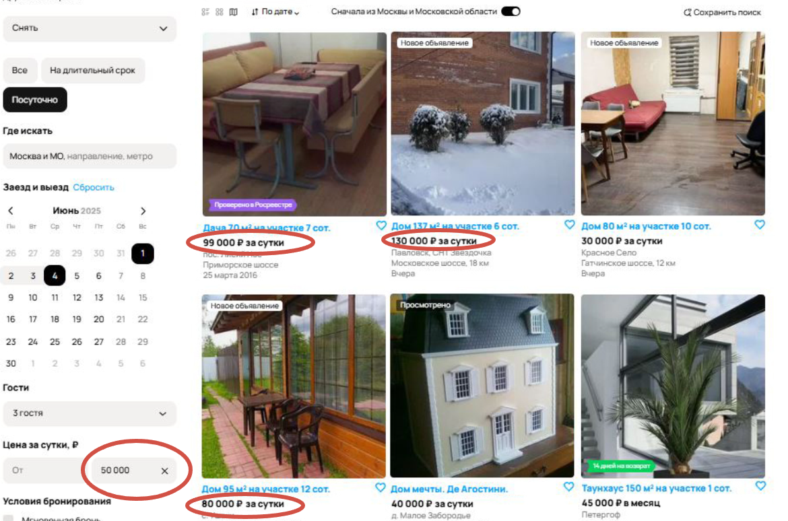

---

**2. Неверный подбор при использовании фильтра по локации.** 
 **Описание: При выборе региона "Москва и МО" в результатах отображаются предложения из Санкт-Петербурга и ЛО (скорее только из ЛО).**  
 **Шаги воспроизведения:** 
  1. Открыть страницу поиска аренды.  
  2. Установить фильтр "Москва и Московская область".  
  3. Просмотреть результаты.  
 Ожидаемый результат: Все предложения соответствуют выбранному региону.  
 Фактический результат: Отображаются предложения из другого региона.  
 Приоритет: High  
Обоснование: Блокирует основной функционал поиска по местоположению.
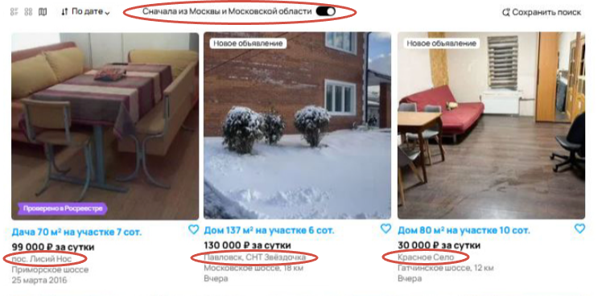

---

**3. Несоответствие нахождения по карте и запроса** 
**Описание:** Игнорируется выбор положения пользователя на карте. Запрос пользователя не пересекается с картой на сайте. 
**Приоритет:** High
**Критичность:** Ложная информация вводит пользователя в заблуждение.
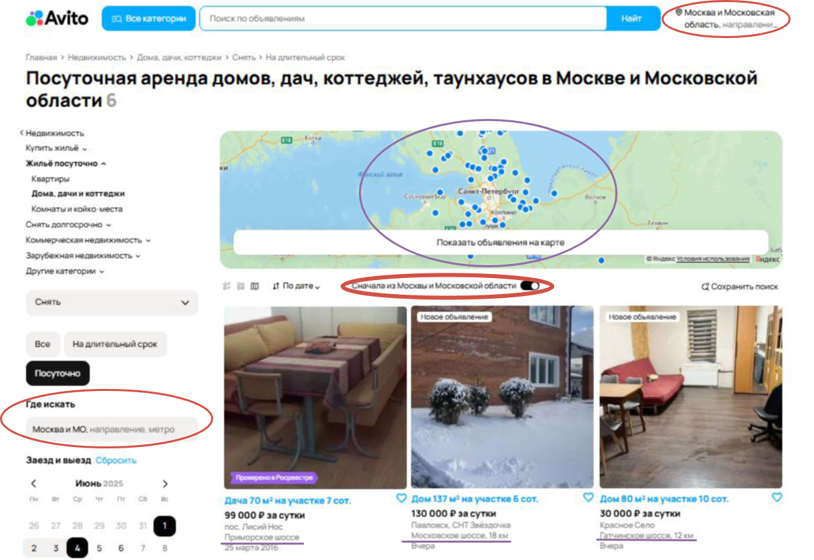

---

**4. Нарушение сортировки объявлений по дате**
**Описание**: В топе результатов отобразилось устаревшее объявление (2016 год). Объявления не отсортированы. Даты публикаций не упорядочены. 
 **Шаги воспроизведения**:  
  1. Установить фильтр “сортировать по дате”.  
  2. Объявления релевантно отсортированы. 
 По результату сортировка по дате не применялась, т.к. даты объявлений не отсортированы и идут в разном порядке.
Приоритет: High
Обоснование: Критическая ошибка функции сортировки, пользователь не может эффективно использовать данную функцию.
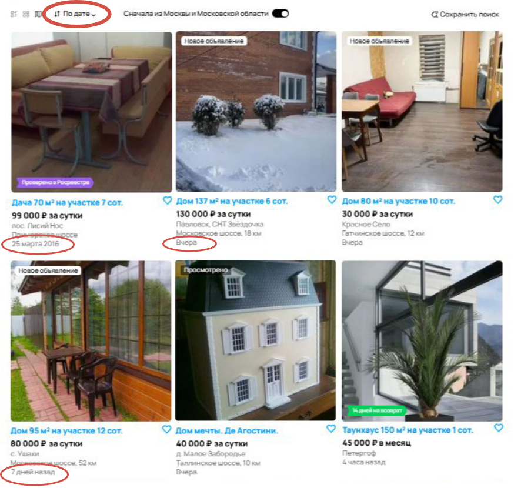

---

**5. Нерелевантные объявления в разделе**  
 **Описание: В категории "Аренда жилья" найдено объявление игрушечного дома и услуги по установке окон.**
 **Шаги воспроизведения:**
  1. Открыть раздел "Аренда жилья".  
  2. Просмотреть список объявлений по поиску аренды жилья.  
 Ожидаемый результат: Все объявления соответствуют категории.  
 Фактический результат: Отображается не релевантные объявления.  
 Приоритет: High
Обоснование: Снижает доверие к системе, не является целью поиска пользователя.

---

## Значительные ошибки (Medium Priority)

**6. Пользователю не показываются бонусы на главной странице.**
**Не везде показаны бонусы за пользование сервисом**
**Из всего поиска только 2 объявления с бонусами**
**Уровень: Medium** 
**Последствия: может уменьшить лояльность клиента к сервису**
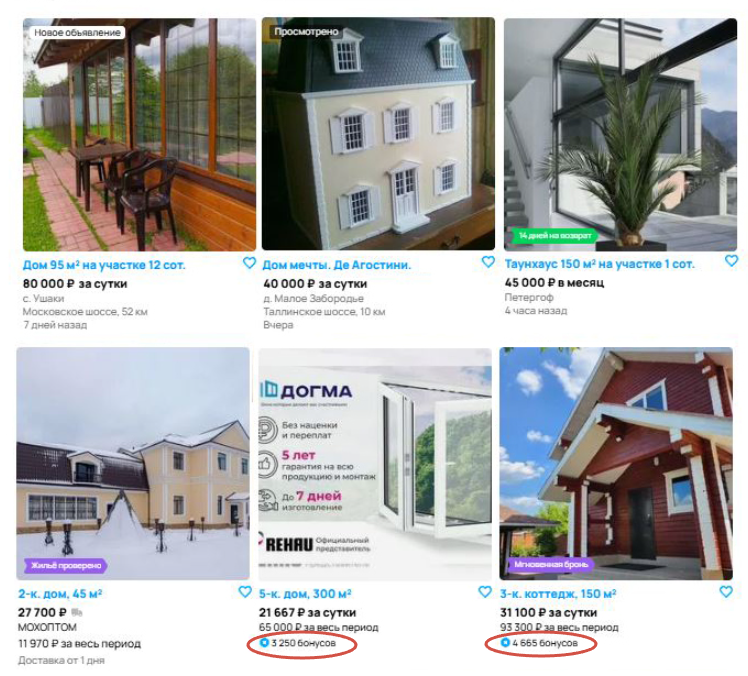

---

**7. Доставка в разделе “недвижимость”.**
**Неверно выведена одна категория - ошибочное попадание другой категории или ошибочное добавление сервиса доставки. В поиске по недвижимости отображается объявление с доставкой. По умолчанию на недвижимость доставка не распространяется.
**Приоритет:** Medium
**Обоснование:** Нарушает ожидания пользователей, но не блокирует работу сервиса.
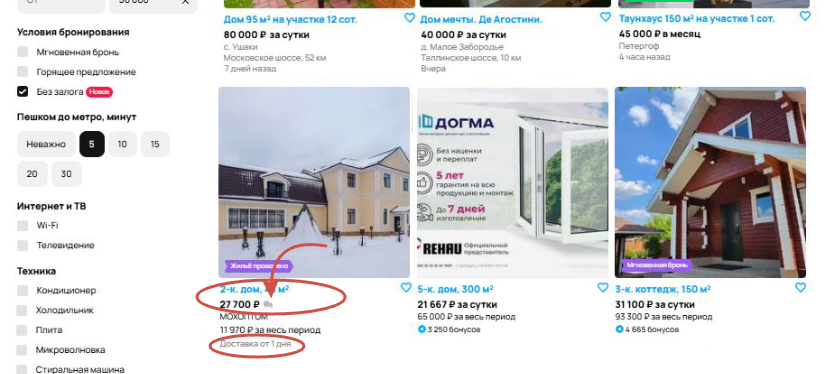

---

**8. Не рассчитывается итоговая стоимость на главной странице.**
**Описание:** Система не рассчитывает/не отображает итоговую стоимость аренды за весь период для нескольких предложений, хотя данные о цене и длительности доступны.
**Приоритет:** Medium
**Обоснование:** Вынуждает пользователя проводить расчеты вручную.
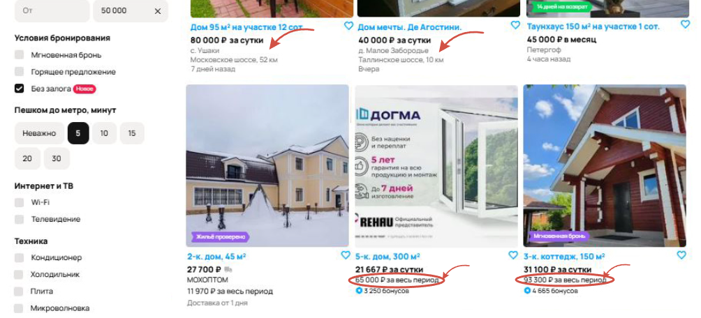

---

**9. Различия в форматах отображения цены**

**Описание:** В разделе "Посуточно" присутствуют предложения со стоимостью съема за месяц, и объявление без уточнения периода.
**Обоснование:** Нарушает ожидания пользователей, но не блокирует работу сервиса. В разных объявлениях используются различные форматы отображения цены: цена за сутки, цена в месяц

**Приоритет:** Medium
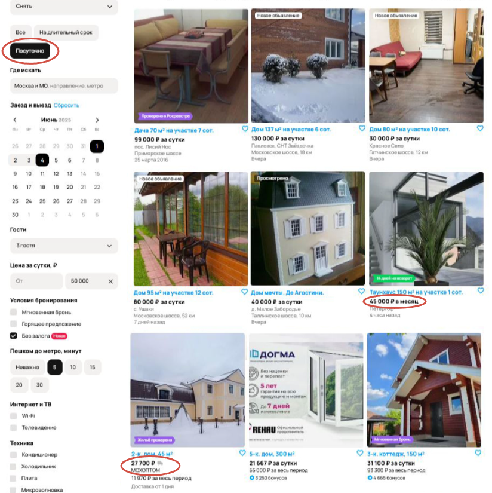

---

**10. Некорректный расчет стоимости за весь период**
**Описание:** Цена за весь период не соответствует корректному расчету по стоимости за сутки * кол-во дней.
**Приоритет:** Medium
**Обоснование:** Логика ценообразования вводит в заблуждение и может влиять на решение о сделке.

---

**11. Не отображаются отзывы и рейтинг на объявлении**
**Описание:** Из всех объявлений только на одном отображен рейтинг и количество отзывов.
Приоритет: Medium
Обоснование: Теряется лояльность клиентов, увеличивается время на поиск отзывов, не предоставлен хороший сервис по поиску
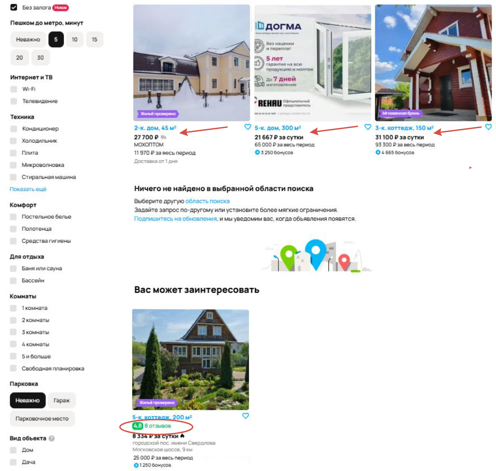

---

**12. Плашка “Ничего не найдено в выбранной области”**
**Описание:** Плашка стоит в некорректном порядке, если ничего не найдено, то плашка должна быть в начале, а если найдено то эта плашка не имеет смысла. В данном случае эта плашка не нужна. 
**Обоснование:** вводит пользователя в заблуждение
**Приоритет:** Medium
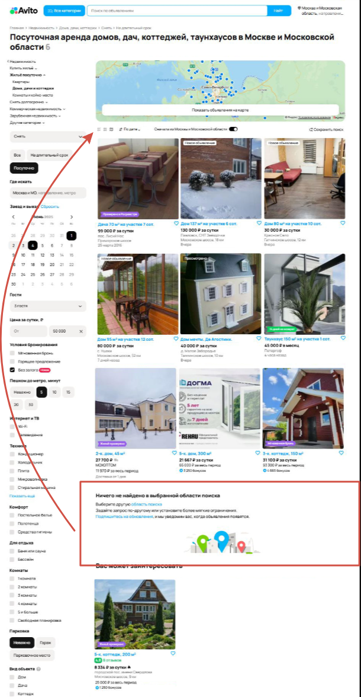

---

**13. Отсутствие даты публикации**  
**Описание:**  В некоторых объявлениях отсутствует дата публикации.  
 **Шаги воспроизведения:**  
  1. Перейти в список объявлений. 
  2. Просмотреть карточки на наличие даты публикации.  
 **Ожидаемый результат:** В каждой карточке указана дата публикации.  
**Фактический результат:** В ряде карточек дата отсутствует (во второй карточке на картинке, где стрелочка).  
**Приоритет:** Medium 
**Обоснование:** Пользователю придется проваливаться в объявление и проверять актуальность публикации самостоятельно, не до конца оказан сервис.

---

**14. Ошибка состояния кнопки "Открытая карта"**
**Описание:** Несоответствие состояния кнопки "Открытая карта". При выборе ярлыка, который находится на картинке, должна открываться полноразмерная карта.
**Приоритет:** Medium
**Обоснование:** Нарушает принцип визуальной согласованности интерфейса, пользователь не получает нужный вид по его запросу.
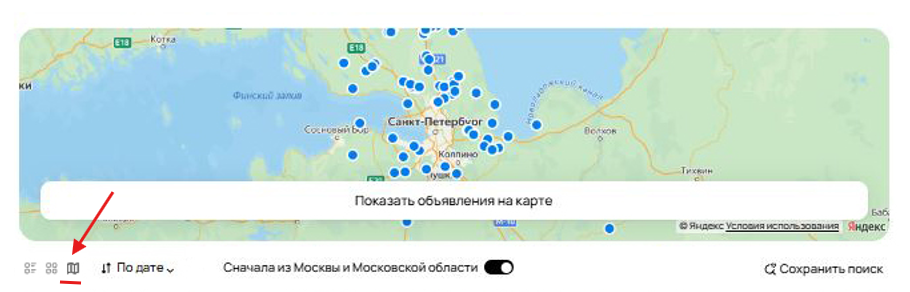

---

## Незначительные ошибки (Low Priority)

**15. Орфографические ошибки**  
**Описание:** Найдены орфографические ошибки в тексте ( "Найт" вместо "Найти").  
 **Шаги воспроизведения:** 
  1. Просмотреть текст на странице.  
 **Ожидаемый результат:** Текст без ошибок.  
 **Фактический результат:** Наличие орфографических ошибок.  
 **Приоритет:** Low  
**Орфографическая ошибка в кнопке "Найти"**
**Обоснование:**  Не влияют на функционал, влияет на визуал главной страницы,  портят впечатление о качестве продукта.

---

**16. Орфографические ошибки**  
**Описание:**  Допущена орфографическая ошибка
**Вместо “Да” нужно “До”**
Приоритет: Low
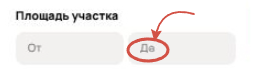

---

**17. Орфографические ошибки**  
**Описание:** Допущена орфографическая ошибка на нижней части страницы
Вместо коко-место - койко-место
 **Приоритет:** Low
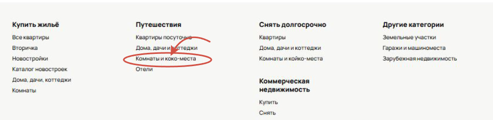

---

**18. Неправильно отображается нумерация главной страницы.** 
**Описание:** При выдаче даже 9 объявлений логичнее, что пользователь находится на 1 странице, а не на 4
 **Приоритет:** Low
**Обоснование:** Не влияют на функционал, влияет на визуал главной страницы.
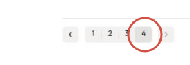

---

**19. Несоответствие количества объявлений**  
**Описание:** В строке поиска указано 6 объявлений, но фактически отображается 9.  
 Шаги воспроизведения:  
  1. Открыть страницу поиска.  
  2. Сравнить количество объявлений в строке поиска и в результатах.  
 Ожидаемый результат: Количество объявлений в строке поиска и в результатах совпадает.  
 Фактический результат: Количество объявлений не совпадает.  
 **Приоритет:** Low
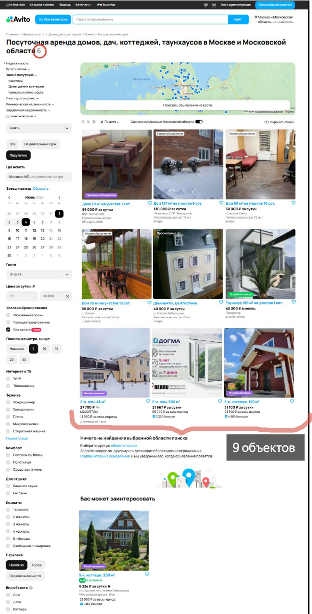

---

**20. Несоответствие заголовка подраздела**  
**Описание:** При фильтре "Посуточно" отображается заголовок "На длительный срок".  
 Шаги воспроизведения:  
  1. Установить фильтр "Посуточно".  
  2. Просмотреть заголовок страницы.  
 Ожидаемый результат: Заголовок соответствует выбранному фильтру.  
 Фактический результат: Заголовок не соответствует фильтру.  
  **Приоритет:** Low
**Обоснование:** влияет на визуал, но не влияет на функционал
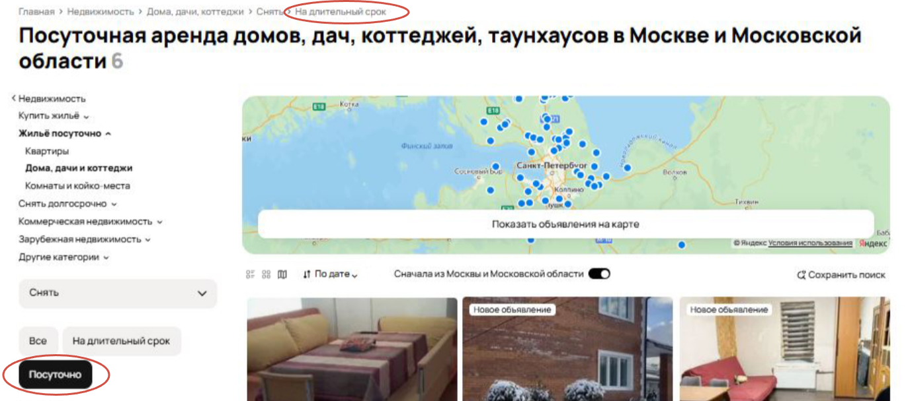
 

---

## 📌 Заключение

Всего обнаружено:
- **5 High**
- **9 Medium**
- **6 Low**

Отчёт составлен по предоставленному скриншоту и визуальному анализу страницы поиска.
